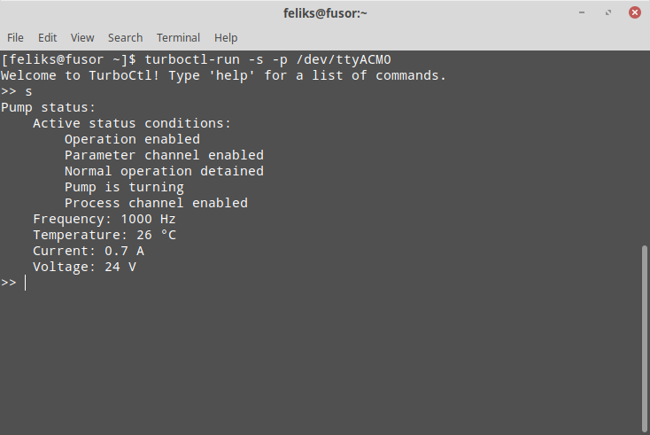
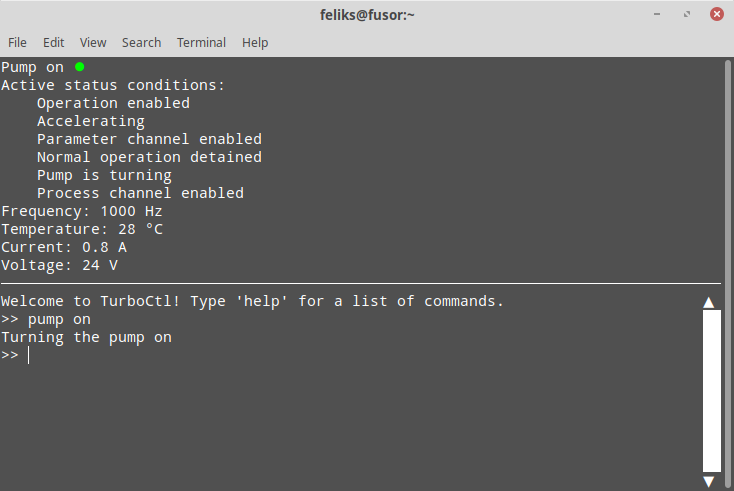

Usage
=====

Running the program
-------------------

The TurboCtl program is run via the :doc:`__main__.py <modules/main>` script
inside the :doc:`modules/index` package. This is done with the command

::

    $ python path/to/turboctl -args

This only works if the ``python`` command is set to run a Python version that
TurboCtl is compatible with; i.e. Python 3.8 or newer. If this is not the case,
substitute ``python`` for a command that runs a compatible version of Python,
e.g. ``python3`` or ``python3.8``.

Because this command requires providing the relative or absolute path of the
:doc:`modules/index` package every time it is used, TurboCtl also provides a
shell script which automatically fills in the path before calling the command.
If the ``TurboCtl`` directory has been added to ``$PATH``, the shell script
can be run from any directory with

::

    $ turboctl-run -args
    
The script uses the ``/usr/bin/env python3`` command to run the program. If
the ``python3`` command is set to use an older Python 3 version that isn't
compatible with TurboCtl, the script should be edited to use a specific newer
version (e.g. ``python3.8``) instead. The script is located in
``TurboCtl/turboctl-run``.

Both of these commands accept the following command-line arguments:

-h, --help          Show a help message that lists all command-line arguments.

-p, --port port     Define the port used for the serial connection.

                    If this argument isn't supplied, the default port
                    ``/dev/ttyUSB0`` will be used. 

-v, --virtual       Run HVCtl with a virtual pump. 

                    If this argument is supplied, instead of sending messages
                    to a real pump, TurboCtl creates a simulated, virtual one
                    and sends messages to that.
                    This makes it possible to test TurboCtl easily without
                    having to connect to a real pump.     
                    This option is incompatible with ``-p``.

-s, --simple        Run TurboCtl with a simple command-line interface that
                    doesn't require :ref:`urwid <dependencies>`.
                    
                    If TurboCtl is run without the ``-s`` argument, a more
                    advanced UI will be used.
                    
-n, --no-poll       Don't send automatic telegrams to the pump.
                    
                    The pump automatically turns off if it doesn't receive any
                    commands for about 10 seconds.
                    Normally TurboCtl sends automatic telegrams to the pump at
                    regular intervals in order to prevent this from happening,
                    and also to keep the status screen in the advanced UI
                    updated.
                    This argument prevents these automatic telegrams from being
                    sent.

-t, --test          Instead of running the TurboCtl program, run all automatic
                    tests for it.

The user interface
------------------

The simple UI (which is used when the ``-s`` argument has been given),
consists of a simple command line interface that runs in the Linux
terminal.

The more advanced UI takes over the entire terminal screen, and features a
simple screen displaying the current status of the pump in addition to the
command-line interface.

In the advanced UI, the area of the command-line interfacew can be scrolled by
using the mouse wheel, or by clicking on or dragging the custom scroll bar on
the right side of the area.
In the simple UI, scrolling is done with the mouse wheel or by using
the built-in terminal scroll bar.
In both UI modes, command history can be accessed by using the up and down
keys.

Commands are given to the UI by writing the name of the command, followed by
its arguments, all separated by spaces. The arguments are pased with
:func:`ast.literal_eval` which recognizes some basic Python objects such as
tuples and lists.
Note that spaces are only accepted between arguments, so an argument of
``[1,2,3]`` is correctly interpreted as a list, but ``[1, 2, 3]`` will raise
an error.

All arguments that cannot be parsed into other object types are interpreted as
:class:`str` objects, so it isn't necessary to use quotes around string
arguments.

Most commands have at least one alias, which can be used instead of the longer
proper command name.

Command list
------------

The following is a list of all the commands recognized by the UI. The same
list can be displayed in the UI by issuing the ``help`` command.

**pump <value>**
    Turn the pump on or off.

    Values of ``1``, ``'True'`` and ``'on'`` turn the pump on;
    ``'0'``, ``'False'`` and ``'off'`` turn it off.

**status**
    Get the status of the pump.

    Aliases: ``s``

**read <number> [index=0]**
    Return the value of parameter *number*, index *index*.

    Aliases: ``r``

**write <number> <value> [index=0]**
    Write *value* to parameter *number*, index *index*.

    Aliases: ``w``

**info <letter> <number>**
    Display information about parameters, errors, or warnings.

    *letter* should be ``'p'``, ``'e'``, or ``'w'`` depending on whether
    *numbers* refer to parameters, errors, or warnings.

    *numbers* should be a list or a tuple of the numbers of those
    parameters/errors/warnings that should be displayed. It can also be a
    single number or ``'all'``, if only a single parameter/error/warning or all
    of them should be listed. 

    Aliases: ``i``

**exit** 
    Exit the UI.

    Aliases: ``e``, ``q``, ``x``

**help [value=None]**
    Display a help message.

    *value* should be the name or an alias of the command that
    should be described.
    If no *value* is specified, all commands are listed and
    described.

    Aliases: ``h``

**debug <value>**
    Activate or deactivate the debug mode.

    Values of ``'1'``, ``'True'`` and ``'on'`` activate the debug mode;
    ``'0'``, ``'False'`` and ``'off'`` deactivate it.

    In normal operation, TypeErrors and ValueErrors
    raised during the execution of commands are caught to prevent
    users from crashing the program with invalid commands.
    Activating the debug mode disables this error-catching in order
    to make debugging easier.

    Aliases: ``d``

**verbose <value>**
    Activate or deactivate the verbose mode.

    Values of ``'1'``, ``'True'`` and ``'on'`` activate the verbose mode;
    ``'0'``, ``'False'`` and ``'off'`` deactivate it.

    When the verbose mode is on, commands that send telegrams to the pump
    will print all the contents of the telegram and the reply to the
    screen.

    Aliases: ``v``

    
Using Screen
------------

As mentioned above, the pump turns off if it doesn't receive any messages
for about 10 seconds. If TurboCtl is run without the ``-n`` argument, it will
send automatic messages which keep the pump on, but the pump will turn off soon
after TurboCtl is closed.

If TurboCtl is used on a local computer, it can simply be left running in the
background. However, if TurboCtl is run over an SSH connection, it cannot be
left running after the connection has been closed without using a third-party
program. An easy way to accomplish this is to use Screen_. This is done as
follows:

- Install Screen with your package manager. For example, on operating systems
  based on Debian or Ubuntu, this is done with the command
  ``apt install screen``.
  
- Log into your remote machine via SSH.

- Start Screen by issuing the ``screen`` command.

- Launch TurboCtl and use it as you would normally.

- Press ``Ctrl-A`` and then ``Ctrl-D`` to detach the Screen session where you
  are running TurboCtl. This will leave TurboCtl running in the background even
  after you close the SSH connection.
  
- Whenever you log back into your remote machine, you can resume the old Screen
  session with ``screen -r``. You can end the screen session by closing
  TurboCtl and then giving the ``exit`` command. Note that due to a bug
  the advanced UI screen of TurboCtl will disappear only after the Screen
  session is closed, even though it should disappear immediately
  after closing TurboCtl. 

.. _screen: https://www.gnu.org/software/screen/
